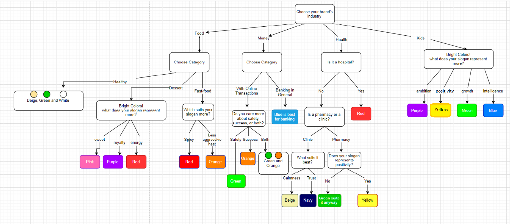

# Brand Identity Guru Expert System
Rule Based Expert System

## Introduction
Brand Identity Guru is a decision-maker expert system that emulates both marketing and design skills of human experts. Its main objective is to help choose the right identity and colors of a brand/product. A marketing expert was contacted to provide all the information about the psychology of colors and how different colors have different psychological effects on consumers like red encourages appetite, blue provides a sense of security, green is eco-friendly, yellow promotes positivity, purple is associated with royalty, and so on. The user will be asked about their brand’s industry and then the system will proceed with a series of questions based on the user’s answers about their brand and what it is all about. Finally, the system will decide the most suitable theme and display it.

## Table of Contents
* [Analysis](#analysis)
* [Design](#design)
* [CLIPS Implementation](#clips-implementation)
* [C# Integration](#c-integration)

## Analysis
The analysis phase consists of knowledge engineering, which basically means contacting the experts - in addition to researches over the internet - getting the information, and then translating it to facts and rules. The information gathered was about the psychology of colors and how different colors have different psychological effects on consumers like red encourages appetite, blue provides a sense of security, green is eco-friendly, yellow promotes positivity, purple is associated with royalty, and so on.


After collecting and analyzing all the data, questions and rules were written in pseudo-code. Below are some of the questions and rules:

#### Questions:
-	Choose your brand’s industry
-	What does your slogan represent more?
-	Is it a hospital?
-	Is it a pharmacy or a clinic?
-	Does your slogan represent positivity?
-	Choose category
-	Do you care more about safety, success, or both?

#### Rules:
-	IF money & banking-in-general THEN blue is best for banking
-	IF money & with-online-transactions & safety THEN green
-	IF money & with-online-transactions & success THEN orange
-	IF money & with-online-transactions & both THEN green and orange

-	IF food & fast-food & spicy THEN red
-	IF food & fast-food & less-aggressive-heat THEN orange
-	IF food & dessert & energy THEN red
-	IF food & dessert & royalty THEN purple

## Design
The design phase includes designing flow charts or decision-trees to make the implementation phase easier. The system was designed so that four industries are taken into consideration: Food, Money, Health and Kids. The tree then continues with a “Choose Category” question to eliminate other valid decisions, and so on.



## CLIPS Implementation

Following the decision-tree above, the rules were translated into clips language and syntax, and a user interface was implemented to interact with the user and get their answers. The program starts by displaying the first question, which is the most general; a question about the brand/product’s industry, and based on a series of user answers to a series of questions, facts are asserted in the working memory to trigger a fire to other rules, and finally the expert system will display the final result. Here is an example of the first two rules and facts asserted:
```
(defrule choose-industry 
   =>
   	(printout t "What is your industry?" crlf)
    (printout t "1 - Kids" crlf)
    (printout t "2 - Health" crlf)
	(printout t "3 - Money" crlf)
	(printout t "4 - Food" crlf)
    (printout t "Enter your response (1, 2, 3 or 4) : " crlf)
	(bind ?ans (read))
	(while (not (or (eq ?ans 1) (eq ?ans 2) (eq ?ans 3) (eq ?ans 4)) ) do
		(printout t "Incorrect response. Enter your response (1, 2, 3 or 4) : " crlf)
		(bind ?ans (read))
	)
    (assert (industry-value ?ans)))
```

```
(defrule kids
	(industry-value 1)
   =>
   	(printout t "Bright Colors! What does your slogan represent more?" crlf)
    (printout t "1 - ambition" crlf)
    (printout t "2 - positivity" crlf)
	(printout t "3 - growth" crlf)
	(printout t "4 - intelligence" crlf)
    (printout t "Enter your response (1, 2 , 3 or 4) : " crlf)
	(bind ?ans (read))
	(while (not (or (eq ?ans 1) (eq ?ans 2)(eq ?ans 3) (eq ?ans 4)) ) do
		(printout t "Incorrect response. Enter your response (1, 2 , 3 or 4) : " crlf)
		(bind ?ans (read))
	)
    (assert (kids-value ?ans)))

```
Below is a screenshot of the final decision from the clips IDE:


## C# Integration
C# integration with clips was made to provide a better and more user friendly experience by programming a windows form application that displays the actual colors in picture boxes at the end of the questions. Technically, [CLIPS.NET](https://github.com/DanaKailani/Brand-Identity-Guru/blob/main/bin/Debug/CLIPSNet.dll) library was used, it is a .NET managed interface for CLIPS (C Language Integrated Production System). It makes it easier to integrate Clips expert system in .NET projects. The clp file was written in a way that the windows form application will understand.

Below is a demo of the program:


Final decision example:

Example 1                  |        Example 2
:-------------------------:|:-------------------------:
  |  

## Future Work
More future work could include implementing type of font and logo shapes.
